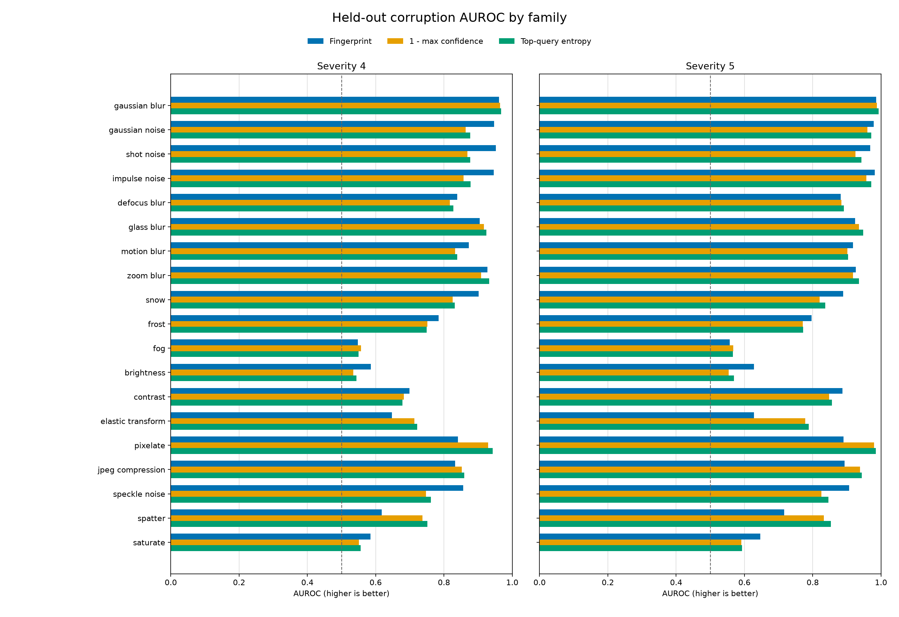

# Fixed COCO corruption benchmark

This repository tests whether a pretrained RT-DETRv2-R18 can detect image corruption
from its query representations. It builds a fingerprint bank from clean COCO training
images and evaluates clean versus corrupted COCO validation images. Nothing is trained.

The benchmark covers all 19 configured corruption families at severities 4 and 5.
Levels 1 through 3 are not evaluated.

## Fixed scores

The fingerprint score uses one fixed method:

1. Keep non-padded training queries with maximum sigmoid confidence of at least 0.5.
2. Build a 2,000-row bank with seeded Algorithm R reservoir sampling.
3. For each validation query, average its cosine distance to the five nearest bank rows.
4. Take the confidence-weighted mean across the image's non-padded queries.

The two baselines are:

- confidence: one minus the maximum sigmoid confidence;
- entropy: normalized Shannon entropy of the highest-confidence non-padded query.

Larger values mean stronger evidence of corruption for all three scores.

## Run the benchmark

Use Python 3.10 or newer, install a PyTorch build for your machine, and then run:

```bash
python -m pip install -r requirements.txt
```

Provide a compatible RT-DETRv2-R18 checkpoint and flat COCO `train2017` and
`val2017` image directories. COCO annotations and manifests are not needed.

```bash
python -m differential_uncertainty benchmark-coco \
  --checkpoint /path/to/rtdetrv2_checkpoint.pth \
  --coco-train-images /path/to/coco/train2017 \
  --coco-val-images /path/to/coco/val2017 \
  --reference-count 2500 \
  --evaluation-count 2500 \
  --output runs/fingerprint-coco-2500 \
  --device cuda:0 \
  --batch-size 4 \
  --seed 44
```

The value 2,500 is an example, not a default. Both image-count flags are required.
Optional defaults are `--device cuda:0`, `--batch-size 1`, and `--seed 44`.

Run the same command again to resume an interruption. The output directory keeps:

- `run_config.json`: the fixed run configuration;
- `bank_progress.pt`: partial bank state, replaced by `bank.pt` when complete;
- `scores/`: one JSON file per completed validation image;
- `evaluation_progress.pt`: the next image and NumPy state for stochastic corruptions.

## Outputs

A completed run writes:

- `per_image_scores.csv`: clean, severity-4, and severity-5 image scores;
- `results.csv`: AUROC for every corruption and severity;
- `summary.json`: the 38 task results, aggregate scores, and paired comparisons;
- `report.md`: the complete plain-language report;
- `corruption_auroc_bars.png`: grouped per-corruption AUROC bars.

The aggregate is the equal-weight mean across the 38 corruption-and-severity tasks.
Paired whole-image bootstrap intervals compare the fingerprint with each baseline on
the supplied evaluation set. They describe stability on that set, not population
confidence. This benchmark measures corruption ranking, not detector accuracy or mAP.

## Method-selection pilot

The chart below is the earlier evidence used to choose the fixed method. That pilot
used 1,000 COCO-val reference images and 250 evaluation images: 150 for method
selection and 100 held out for validation. It predates the current COCO-train to
COCO-val runner and is not the final 2,500-by-2,500 result.

On the held-out pilot images, mean AUROC across the 38 strong-corruption tasks was
0.822 for the fingerprint, 0.813 for confidence, and 0.822 for entropy. The paired
intervals for fingerprint minus either baseline included zero, so the pilot did not
establish that the fingerprint was better overall. The per-corruption chart shows
where each score was stronger or weaker; an AUROC of 0.5 is chance-level ranking.


