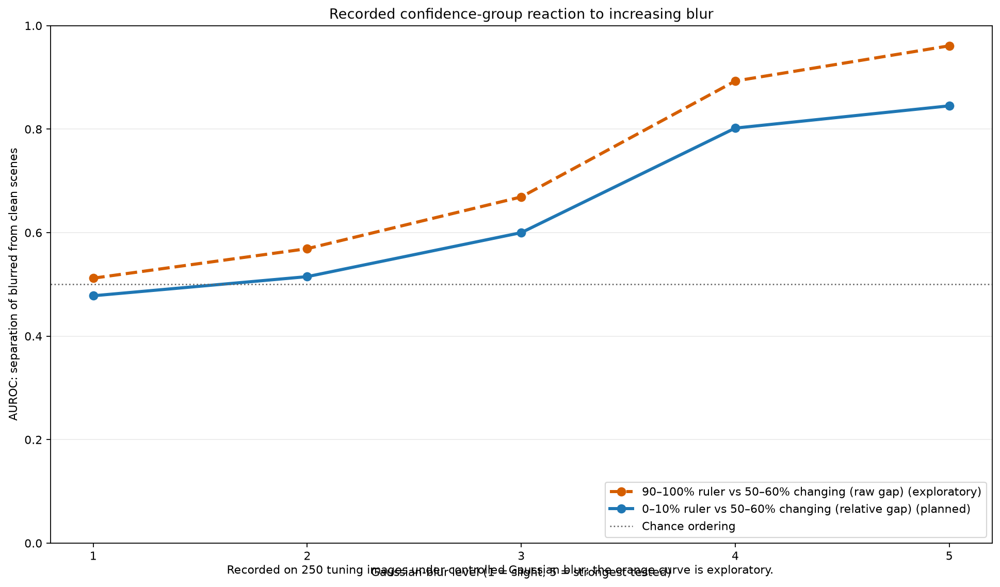

# Scene reliability: an intuitive guide to our query-based method

This reference is for construction and agricultural vehicle design teams. It explains why a camera-based perception system may become less reliable as the **whole scene** becomes visually unfamiliar, and how the method in this repository produces a scene-level signal for that situation.

The goal is understanding: different companies may choose different downstream responses to the signal.

## 1. The problem: a capable detector can meet an unfamiliar scene

A camera system is normally developed and validated using a particular range of lighting, visibility, surfaces, machinery, and camera conditions. In off-road work, that range can change abruptly:

- A construction vehicle enters a dust plume, passes from shade into low-angle glare, or has mud on its camera lens.
- An agricultural vehicle encounters fog, heavy rain, spray, dusk, or a field whose wet soil and crop residue change the visual texture of the scene.

The detector will usually still produce outputs. The important question is not merely whether it returned an answer; it is whether its internal behaviour still resembles behaviour seen in familiar, clean reference scenes.

Our method turns that question into one scene-reliability score. A high score means that the pattern inside the detector is comparatively unfamiliar. It is a prompt to understand a limitation, validate the condition, and apply a company-specific downstream policy if one exists.

## 2. The minimum detector background

A query-based detector does not begin by scanning a fixed grid of candidate boxes in the traditional way. Instead, it starts with a fixed number of **queries**. You can picture a query as an empty candidate-object slot that asks, “Is there useful evidence for an object here, and if so, where and what might it be?”

For one image, the queries look at the image evidence and exchange context with one another. In informal terms, the queries are “talking to each other”: one candidate can use information from the rest of the scene to refine its own conclusion. At the end, each query has a class confidence, a proposed box, and an internal activity pattern.

The method here uses those internal activity patterns. It does not need to decide that one individual item in the scene is unusual.

### Confidence is useful, but it is not the whole answer

Detector confidence is the model’s own strength of preference for a proposed class. It is not a guarantee that the scene is familiar or that the answer is correct. A model can be confident while operating under conditions it did not adequately learn or validate.

That is why the method compares the **way the detector behaves internally** with a library of familiar behaviour.

## 3. From query activity to a behavioural fingerprint

Each query passes through shared parts of the detector. The values that become active inside those parts form a pattern. We summarise the pattern as a **topological fingerprint**.

Here, “topological” does not mean geographic terrain. It means the structure of connections among internal activity values: which connections are strong, which are weak, and how that structure is arranged. The fingerprint is a compact signature of how that query reached its result.

Two queries can predict similar labels yet have different fingerprints if the detector arrived there in different internal ways. Conversely, similar fingerprints mean that the detector is behaving in a familiar way, even when the visual scene is not identical.

```text
camera scene
    ↓
many coordinated queries
    ↓
one internal activity pattern per query
    ↓
one compact behavioural fingerprint per query
```

## 4. Building a library of familiar behaviour

Before evaluating a new scene, we run the frozen detector on clean reference images. We retain many query fingerprints from those images in a **clean reference bank**. In the current workflow, the searchable bank holds 25,000 fingerprints and each new fingerprint is compared with its five nearest neighbours in that bank.

For each query in a new scene:

1. Find its five most similar fingerprints in the clean bank.
2. Average those five distances.
3. Treat the result as that query’s **unfamiliarity distance**.

A small distance means that the query behaved similarly to known clean-scene examples. A large distance means that even its closest clean examples are not very similar.

This distance is not a probability. For example, a value of 0.8 does not mean an 80% chance that the system is wrong.

## 5. Why use two query groups inside one scene?

One scene may naturally make all query distances a little larger or smaller. Rather than relying only on one absolute value, the method compares two confidence-ranked query groups from the **same scene**.

After ranking valid queries by detector confidence, the current workflow uses:

- the **90–100% confidence group** as the reference, or ruler group; and
- the **50–60% confidence group** as the changing group.

“Ruler” means a local comparison point inside the scene. It does not mean that every reference query must be perfectly unchanged as conditions worsen. The useful question is whether the changing group becomes unusually different **relative to** the ruler group.

### How the group idea was found

The group choices came from controlled experiments, not from a universal rule about all detectors. Researchers took the same 250 tuning images, applied increasing Gaussian blur, tried alternative confidence groups, and asked which comparisons best ordered and separated clean versus blurred scenes.

The planned experiment tested the **0–10% group as a ruler** against the 50–60% group using a relative gap. That planned comparison passed its stated tuning checks, but it was weak for slight blur.

A later analysis observed that the 90–100% and 50–60% groups reacted in different directions. Their raw-gap comparison was stronger on the same tuning data, especially under heavy blur, but it was exploratory and did not satisfy the preset slight-blur decision rule. The current implementation fixes the 90–100% and 50–60% groups, then uses a relative gap; the historical raw-gap curve below explains the motivation, not a deployment-performance claim for the current workflow.



**Figure 1.** Recorded Gaussian-blur tuning evidence. Both comparisons are weak near the lightest blur level. The orange high-versus-middle curve was selected after inspecting earlier tuning results and is therefore exploratory.

| Blur level | Planned 0–10% ruler vs 50–60% changing, relative gap | Exploratory 90–100% ruler vs 50–60% changing, raw gap |
|---:|---:|---:|
| 1 | 0.478 | 0.512 |
| 2 | 0.515 | 0.569 |
| 3 | 0.600 | 0.669 |
| 4 | 0.802 | 0.893 |
| 5 | 0.845 | 0.961 |

The values are AUROC: 0.5 is chance-level ordering; 1.0 is perfect clean-versus-blurred ordering. The exact values used for the figure are available in [the accompanying CSV](scene-reliability-group-evidence.csv).

## 6. Calculating the final scene score

For the current scene, let:

```text
reference = average unfamiliarity distance of the 90–100% group
changing  = average unfamiliarity distance of the 50–60% group
```

The primary score is the **relative gap**:

```text
scene reliability score = 2 × (changing − reference) / (changing + reference)
```

In plain language: the score asks whether the group expected to be responsive is behaving more unusually than the high-confidence reference group in this same scene. A larger positive separation is more evidence that the scene is unlike the clean conditions represented in the reference bank.

```text
new camera scene
    → queries coordinate using image evidence
    → fingerprints are compared with the clean bank
    → queries are ranked by confidence
    → compare 90–100% ruler group with 50–60% changing group
    → one relative-gap scene score
```

## 7. Two ways to read the signal

### Dusty construction scene

Imagine a haul road where a dust plume and low sun reduce contrast. The detector may still emit plausible proposals. If the changing group becomes much more unfamiliar than its in-scene ruler, the score rises. The result says that this visual condition differs from the clean reference behaviour. It does not tell a product team what action to take.

### Foggy or rainy agricultural scene

Imagine a tractor operating at dawn as fog thickens, or under rain that creates reflections and droplets. The same calculation compares query fingerprints with clean references and then compares the two confidence bands. A rising score indicates that this camera scene is becoming less like the conditions represented in the bank.

Neither example establishes validated performance in dust, fog, or rain. The recorded evidence in this repository is controlled Gaussian blur. Each operating condition needs representative data and validation before a team can make a stronger claim.

## 8. What the score supports—and what it does not

The score supports a discussion of scene familiarity and a way to identify conditions that deserve testing. It can be logged, reviewed alongside other signals, or connected to a company policy. Those choices are outside this method.

The score does **not** by itself provide:

- a probability that the detector is wrong;
- a safety decision or an automation-degradation policy;
- a guarantee that every unfamiliar scene will receive a high score; or
- validation for rain, fog, dust, darkness, glare, or lens contamination merely because blur results exist.

## Glossary

| Term | Plain-language meaning |
|---|---|
| Query | A candidate-object slot that gathers image evidence and coordinates with other candidate slots. |
| Query confidence | How strongly the detector prefers a query’s predicted class; not a guarantee of correctness. |
| Fingerprint | A compact signature of a query’s internal activity pattern. |
| Clean reference bank | Stored fingerprints from familiar, clean images used as comparison examples. |
| Nearest neighbours | The most similar fingerprints in the bank; this workflow averages the five closest. |
| Unfamiliarity distance | How different a new query fingerprint is from its closest clean-bank fingerprints. |
| Ruler group | The reference confidence group used to make a within-scene comparison. |
| Changing group | The confidence group whose unfamiliarity is compared with the ruler group. |
| Relative gap | The normalized difference between the changing and ruler group averages. |
| AUROC | A ranking measure: 0.5 is chance-level clean-versus-degraded ordering and 1.0 is perfect ordering. |

## Source for the recorded evidence

The group-reaction values and their planned-versus-exploratory interpretation are reproduced from the project’s [within-image contrast report](../scene-uncertainty-within-image-contrast-results.md).
